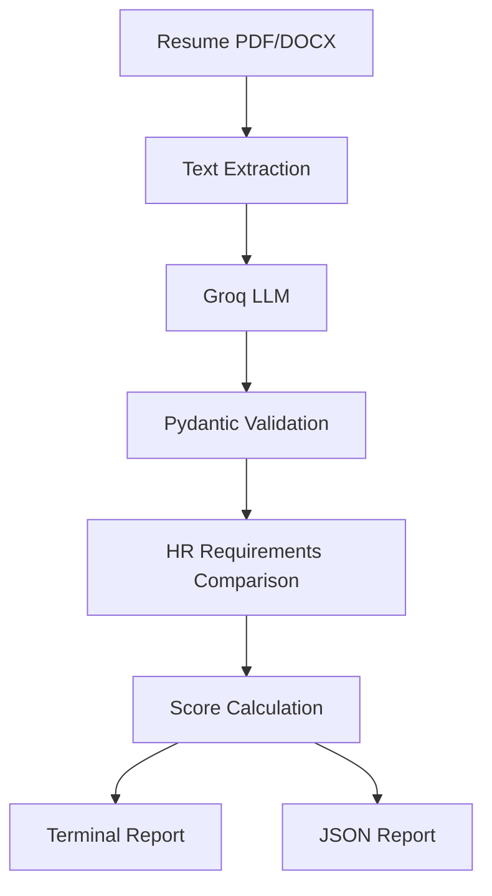
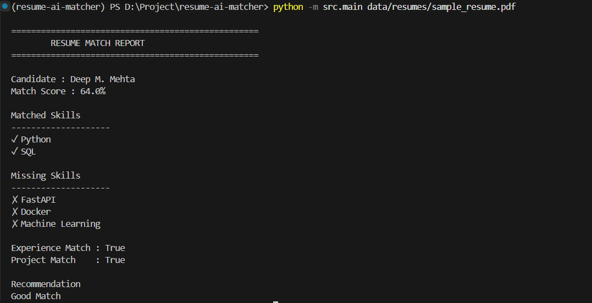

# 📄 Resume AI Matcher


An AI-powered Resume Matcher that extracts information from PDF/DOCX resumes using an LLM (Groq), compares the extracted data against HR requirements, and generates a resume match score with a detailed report.

---

## ✨ Features

- 📄 Extract text from PDF and DOCX resumes
- 🤖 Extract structured information using Groq LLM
- ✅ Validate output using Pydantic
- 🎯 Compare candidate profile with HR requirements
- 📊 Calculate a resume match percentage
- 📝 Generate a human-readable report
- 💾 Save analysis as JSON
- 💻 Command-line interface (CLI)

---

## 🏗️ Architecture



---

## 📸 Sample Output



---

## 🛠️ Tech Stack

- Python
- Groq API
- Pydantic
- PyPDF
- python-docx
- python-dotenv

---

## 📂 Project Structure

```text
resume-ai-matcher/
├── data/
├── output/
├── src/
├── requirements.txt
├── README.md
├── LICENSE
└── .gitignore
```

---

## 🚀 Installation

### Clone the repository

```bash
git clone https://github.com/jrpandadev/resume-ai-matcher.git
```

### Move into the project

```bash
cd resume-ai-matcher
```

### Create a virtual environment

```bash
python -m venv .venv
```

### Activate it

Windows

```bash
.venv\Scripts\activate
```

```powershell
.\.venv\Scripts\Activate.ps1
```

**Windows (Command Prompt)**

```cmd
.venv\Scripts\activate.bat
```

Linux/macOS

```bash
source .venv/bin/activate
```

### Install dependencies

```bash
pip install -r requirements.txt
```

### Create a `.env` file

```env
GROQ_API_KEY=your_api_key_here
```

---

## ▶️ Usage

Analyze a resume:

```bash
python -m src.main data/resumes/sample_resume.pdf
```

---

## 📊 Sample Output

```text
Candidate : Deep M. Mehta

Match Score : 64%

Matched Skills
✓ Python
✓ SQL

Missing Skills
✗ FastAPI
✗ Docker
✗ Machine Learning

Recommendation
Good Match
```

---

## 🔮 Future Improvements

- FastAPI REST API
- Streamlit Web UI
- Semantic skill matching
- Batch resume screening
- Docker support
- Unit tests
- CI/CD using GitHub Actions

---

## 📜 License

This project is licensed under the MIT License.
